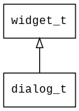
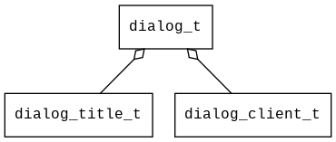

## dialog\_t
### 概述



 对话框。 对话框是一种特殊的窗口，大小和位置可以自由设置。

 AWTK中的对话框可以是模态的，也可以是非模态的。

 如果dialog有透明或半透效果则不支持窗口动画。

> 由于浏览器中无法实现主循环嵌套，因此无法实现模态对话框。
 如果希望自己写的AWTK应用程序可以在浏览器(包括各种小程序)中运行或演示，
 请避免使用模态对话框。

 对话框通常由对话框标题和对话框客户区两部分组成：

 


 dialog\_t是[window\_base\_t](window_base_t.md)的子类控件，window\_base\_t的函数均适用于dialog\_t控件。

 在xml中使用"dialog"标签创建对话框。如：

 ```xml
 <dialog anim_hint="center_scale(duration=300)" x="c" y="m" w="80%" h="160" text="Dialog">
 <dialog_title x="0" y="0" w="100%" h="30" text="Hello AWTK" />
 <dialog_client x="0" y="bottom" w="100%" h="-30">
   <label name="" x="center" y="middle:-20" w="200" h="30" text="Are you ready?"/>
   <button name="quit" x="10" y="bottom:10" w="40%" h="30" text="确定"/>
   <button name="quit" x="right:10" y="bottom:10" w="40%" h="30" text="取消"/>
 </dialog_client>
 </dialog>
 ```

 如果你不需要对话框的标题，可以这样写：

 ```xml
 <dialog anim_hint="center_scale(duration=300)" x="c" y="m" w="80%" h="160" text="Dialog">
   <label name="" x="center" y="middle:-20" w="200" h="30" text="Are you ready?"/>
   <button name="quit" x="10" y="bottom:10" w="40%" h="30" text="确定"/>
   <button name="quit" x="right:10" y="bottom:10" w="40%" h="30" text="取消"/>
 </dialog>
 ```

 打开非模态对话框时，其用法与普通窗口一样。打开非模态对话框时，还需要调用dialog\_modal。

 ```c
  widget_t* dlg = dialog_open(name);

  ret = dialog_modal(dlg);
 ```

 关闭模态对话框用dialog\_quit

 ```c
 static ret_t on_dialog_btn_click(void* ctx, event_t* evt) {
   widget_t* win = widget_get_window(WIDGET(evt->target));
   int code = (char*)ctx - (char*)NULL;

   dialog_quit(win, code);

    return RET_OK;
 }
 ```

 关闭非模态对话框用window\_close。

 ```c
 static ret_t on_dialog_btn_click(void* ctx, event_t* evt) {
   widget_t* win = widget_get_window(WIDGET(evt->target));
   int code = (char*)ctx - (char*)NULL;

   window_close(win);

   return RET_OK;
 }
 ```

 > 更多用法请参考：
 [dialog.xml](https://github.com/zlgopen/awtk/blob/master/demos/assets/raw/ui/)

 > 完整C代码示例请参考：

 * [非模态对话框](https://github.com/zlgopen/awtk-c-demos/blob/master/demos/dialog.c)

 * [模态对话框](https://github.com/zlgopen/awtk-c-demos/blob/master/demos/dialog_modal.c)

可用通过style来设置控件的显示风格，如字体的大小和颜色等等。如：

 ```xml
 <style name="default">
   <normal border_color="#606060" />
 </style>
 ```

 > 更多用法请参考：
 [theme default]
 (https://github.com/zlgopen/awtk/blob/master/demos/assets/raw/styles/default.xml#L324)


----------------------------------
### 函数
<p id="dialog_t_methods">

| 函数名称 | 说明 | 
| -------- | ------------ | 
| <a href="#dialog_t_dialog_cast">dialog\_cast</a> | 转换dialog对象(供脚本语言使用)。 |
| <a href="#dialog_t_dialog_confirm">dialog\_confirm</a> | 显示『确认』对话框。 |
| <a href="#dialog_t_dialog_create">dialog\_create</a> | 创建dialog对象。 |
| <a href="#dialog_t_dialog_create_simple">dialog\_create\_simple</a> | 创建dialog对象，同时创建title/client。 |
| <a href="#dialog_t_dialog_get_client">dialog\_get\_client</a> | 获取client控件。 |
| <a href="#dialog_t_dialog_get_title">dialog\_get\_title</a> | 获取title控件。 |
| <a href="#dialog_t_dialog_info">dialog\_info</a> | 显示『提示信息』对话框。 |
| <a href="#dialog_t_dialog_is_modal">dialog\_is\_modal</a> | 检查对话框是否为模态对话框。 |
| <a href="#dialog_t_dialog_is_quited">dialog\_is\_quited</a> | 检查对话框是否已经退出模态。 |
| <a href="#dialog_t_dialog_modal">dialog\_modal</a> | 模态显示对话框。 |
| <a href="#dialog_t_dialog_open">dialog\_open</a> | 从资源文件中加载并创建Dialog对象。 |
| <a href="#dialog_t_dialog_quit">dialog\_quit</a> | 退出模态显示，关闭对话框。 |
| <a href="#dialog_t_dialog_set_title">dialog\_set\_title</a> | 设置对话框的标题文本。 |
| <a href="#dialog_t_dialog_toast">dialog\_toast</a> | 显示『短暂提示信息』对话框。 |
| <a href="#dialog_t_dialog_warn">dialog\_warn</a> | 显示『警告』对话框。 |
### 属性
<p id="dialog_t_properties">

| 属性名称 | 类型 | 说明 | 
| -------- | ----- | ------------ | 
| <a href="#dialog_t_highlight">highlight</a> | const char* | 对话框高亮策略。 |
#### dialog\_cast 函数
-----------------------

* 函数功能：

> <p id="dialog_t_dialog_cast"> 转换dialog对象(供脚本语言使用)。


* 函数原型：

```
widget_t* dialog_cast (widget_t* widget);
```

* 参数说明：

| 参数 | 类型 | 说明 |
| -------- | ----- | --------- |
| 返回值 | widget\_t* | dialog对象。 |
| widget | widget\_t* | dialog对象。 |
#### dialog\_confirm 函数
-----------------------

* 函数功能：

> <p id="dialog_t_dialog_confirm"> 显示『确认』对话框。

 主题由dialog_confirm.xml文件决定。


* 函数原型：

```
ret_t dialog_confirm (const char* title, const char* text);
```

* 参数说明：

| 参数 | 类型 | 说明 |
| -------- | ----- | --------- |
| 返回值 | ret\_t | 返回RET\_OK表示确认，否则表示取消。 |
| title | const char* | 标题。 |
| text | const char* | 文本内容。 |
#### dialog\_create 函数
-----------------------

* 函数功能：

> <p id="dialog_t_dialog_create"> 创建dialog对象。


* 函数原型：

```
widget_t* dialog_create (widget_t* parent, xy_t x, xy_t y, wh_t w, wh_t h);
```

* 参数说明：

| 参数 | 类型 | 说明 |
| -------- | ----- | --------- |
| 返回值 | widget\_t* | dialog对象。 |
| parent | widget\_t* | 父控件 |
| x | xy\_t | x坐标 |
| y | xy\_t | y坐标 |
| w | wh\_t | 宽度 |
| h | wh\_t | 高度 |
#### dialog\_create\_simple 函数
-----------------------

* 函数功能：

> <p id="dialog_t_dialog_create_simple"> 创建dialog对象，同时创建title/client。


* 函数原型：

```
widget_t* dialog_create_simple (widget_t* parent, xy_t x, xy_t y, wh_t w, wh_t h);
```

* 参数说明：

| 参数 | 类型 | 说明 |
| -------- | ----- | --------- |
| 返回值 | widget\_t* | dialog对象。 |
| parent | widget\_t* | 父控件 |
| x | xy\_t | x坐标 |
| y | xy\_t | y坐标 |
| w | wh\_t | 宽度 |
| h | wh\_t | 高度 |
#### dialog\_get\_client 函数
-----------------------

* 函数功能：

> <p id="dialog_t_dialog_get_client"> 获取client控件。


* 函数原型：

```
widget_t* dialog_get_client (widget_t* widget);
```

* 参数说明：

| 参数 | 类型 | 说明 |
| -------- | ----- | --------- |
| 返回值 | widget\_t* | client对象。 |
| widget | widget\_t* | dialog对象。 |
#### dialog\_get\_title 函数
-----------------------

* 函数功能：

> <p id="dialog_t_dialog_get_title"> 获取title控件。


* 函数原型：

```
widget_t* dialog_get_title (widget_t* widget);
```

* 参数说明：

| 参数 | 类型 | 说明 |
| -------- | ----- | --------- |
| 返回值 | widget\_t* | title对象。 |
| widget | widget\_t* | dialog对象。 |
#### dialog\_info 函数
-----------------------

* 函数功能：

> <p id="dialog_t_dialog_info"> 显示『提示信息』对话框。

 主题由dialog_info.xml文件决定。


* 函数原型：

```
ret_t dialog_info (const char* title, const char* text);
```

* 参数说明：

| 参数 | 类型 | 说明 |
| -------- | ----- | --------- |
| 返回值 | ret\_t | 返回RET\_OK表示成功，否则表示失败。 |
| title | const char* | 标题。 |
| text | const char* | 文本内容。 |
#### dialog\_is\_modal 函数
-----------------------

* 函数功能：

> <p id="dialog_t_dialog_is_modal"> 检查对话框是否为模态对话框。


* 函数原型：

```
bool_t dialog_is_modal (widget_t* widget);
```

* 参数说明：

| 参数 | 类型 | 说明 |
| -------- | ----- | --------- |
| 返回值 | bool\_t | 返回TRUE表示是模态对话框，否则表示不是。 |
| widget | widget\_t* | dialog对象。 |
#### dialog\_is\_quited 函数
-----------------------

* 函数功能：

> <p id="dialog_t_dialog_is_quited"> 检查对话框是否已经退出模态。


* 函数原型：

```
bool_t dialog_is_quited (widget_t* widget);
```

* 参数说明：

| 参数 | 类型 | 说明 |
| -------- | ----- | --------- |
| 返回值 | bool\_t | 返回TRUE表示已经退出，否则表示没有。 |
| widget | widget\_t* | dialog对象。 |
#### dialog\_modal 函数
-----------------------

* 函数功能：

> <p id="dialog_t_dialog_modal"> 模态显示对话框。
 dialog_modal返回后，dialog对象将在下一个idle函数中回收。
 也就是在dialog_modal调用完成后仍然可以访问dialog中控件，直到本次事件结束。


* 函数原型：

```
ret_t dialog_modal (widget_t* widget);
```

* 参数说明：

| 参数 | 类型 | 说明 |
| -------- | ----- | --------- |
| 返回值 | ret\_t | 返回RET\_OK表示成功，否则表示失败。 |
| widget | widget\_t* | dialog对象。 |
#### dialog\_open 函数
-----------------------

* 函数功能：

> <p id="dialog_t_dialog_open"> 从资源文件中加载并创建Dialog对象。

 本函数在ui\_loader/ui\_builder_default里实现。


* 函数原型：

```
widget_t* dialog_open (const char* name);
```

* 参数说明：

| 参数 | 类型 | 说明 |
| -------- | ----- | --------- |
| 返回值 | widget\_t* | 对象。 |
| name | const char* | dialog的名称。 |
#### dialog\_quit 函数
-----------------------

* 函数功能：

> <p id="dialog_t_dialog_quit"> 退出模态显示，关闭对话框。

> 比如，在对话框中关闭按钮的事件处理函数中，调用本函数关闭对话框。


* 函数原型：

```
ret_t dialog_quit (widget_t* widget, uint32_t code);
```

* 参数说明：

| 参数 | 类型 | 说明 |
| -------- | ----- | --------- |
| 返回值 | ret\_t | 返回RET\_OK表示成功，否则表示失败。 |
| widget | widget\_t* | dialog对象。 |
| code | uint32\_t | 退出码，作为dialog\_modal的返回值。 |
#### dialog\_set\_title 函数
-----------------------

* 函数功能：

> <p id="dialog_t_dialog_set_title"> 设置对话框的标题文本。


* 函数原型：

```
ret_t dialog_set_title (widget_t* widget, char* title);
```

* 参数说明：

| 参数 | 类型 | 说明 |
| -------- | ----- | --------- |
| 返回值 | ret\_t | 返回RET\_OK表示成功，否则表示失败。 |
| widget | widget\_t* | dialog对象。 |
| title | char* | 标题。 |
#### dialog\_toast 函数
-----------------------

* 函数功能：

> <p id="dialog_t_dialog_toast"> 显示『短暂提示信息』对话框。

 主题由dialog_toast.xml文件决定。


* 函数原型：

```
ret_t dialog_toast (const char* text, uint32_t duration);
```

* 参数说明：

| 参数 | 类型 | 说明 |
| -------- | ----- | --------- |
| 返回值 | ret\_t | 返回RET\_OK表示成功，否则表示失败。 |
| text | const char* | 文本内容。 |
| duration | uint32\_t | 显示时间(单位为毫秒)。 |
#### dialog\_warn 函数
-----------------------

* 函数功能：

> <p id="dialog_t_dialog_warn"> 显示『警告』对话框。

 主题由dialog_warn.xml文件决定。


* 函数原型：

```
ret_t dialog_warn (const char* title, const char* text);
```

* 参数说明：

| 参数 | 类型 | 说明 |
| -------- | ----- | --------- |
| 返回值 | ret\_t | 返回RET\_OK表示成功，否则表示失败。 |
| title | const char* | 标题。 |
| text | const char* | 文本内容。 |
#### highlight 属性
-----------------------
> <p id="dialog_t_highlight"> 对话框高亮策略。


* 类型：const char*

| 特性 | 是否支持 |
| -------- | ----- |
| 可直接读取 | 是 |
| 可直接修改 | 否 |
| 可持久化   | 是 |
| 可脚本化   | 是 |
| 可在IDE中设置 | 是 |
| 可在XML中设置 | 是 |
| 可通过widget\_get\_prop读取 | 是 |
| 可通过widget\_set\_prop修改 | 是 |
