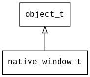

## native\_window\_t
### 概述


 原生窗口。


----------------------------------
### 函数
<p id="native_window_t_methods">

| 函数名称 | 说明 | 
| -------- | ------------ | 
| <a href="#native_window_t_native_window_create">native\_window\_create</a> | 创建win对象。 |
| <a href="#native_window_t_native_window_get_canvas">native\_window\_get\_canvas</a> | 获取canvas。 |
| <a href="#native_window_t_native_window_invalidate">native\_window\_invalidate</a> | 请求重绘指定区域。 |
| <a href="#native_window_t_native_window_move">native\_window\_move</a> | 移动窗口。 |
| <a href="#native_window_t_native_window_resize">native\_window\_resize</a> | 调整窗口大小。 |
#### native\_window\_create 函数
-----------------------

* 函数功能：

> <p id="native_window_t_native_window_create"> 创建win对象。


* 函数原型：

```
native_window_t* native_window_create (const char* params);
```

* 参数说明：

| 参数 | 类型 | 说明 |
| -------- | ----- | --------- |
| 返回值 | native\_window\_t* | 返回win对象。 |
| params | const char* | 参数。 |
#### native\_window\_get\_canvas 函数
-----------------------

* 函数功能：

> <p id="native_window_t_native_window_get_canvas"> 获取canvas。


* 函数原型：

```
canvas_t native_window_get_canvas (native_window_t* win);
```

* 参数说明：

| 参数 | 类型 | 说明 |
| -------- | ----- | --------- |
| 返回值 | canvas\_t | 返回canvas对象。 |
| win | native\_window\_t* | win对象。 |
#### native\_window\_invalidate 函数
-----------------------

* 函数功能：

> <p id="native_window_t_native_window_invalidate"> 请求重绘指定区域。


* 函数原型：

```
ret_t native_window_invalidate (native_window_t* win, rect_t* r);
```

* 参数说明：

| 参数 | 类型 | 说明 |
| -------- | ----- | --------- |
| 返回值 | ret\_t | 返回RET\_OK表示成功，否则表示失败。 |
| win | native\_window\_t* | win对象。 |
| r | rect\_t* | 重绘区域。 |
#### native\_window\_move 函数
-----------------------

* 函数功能：

> <p id="native_window_t_native_window_move"> 移动窗口。


* 函数原型：

```
ret_t native_window_move (native_window_t* win, xy_t x, xy_t y, bool_t force);
```

* 参数说明：

| 参数 | 类型 | 说明 |
| -------- | ----- | --------- |
| 返回值 | ret\_t | 返回RET\_OK表示成功，否则表示失败。 |
| win | native\_window\_t* | win对象。 |
| x | xy\_t | x坐标。 |
| y | xy\_t | y坐标。 |
| force | bool\_t | 无论是否shared都move。 |
#### native\_window\_resize 函数
-----------------------

* 函数功能：

> <p id="native_window_t_native_window_resize"> 调整窗口大小。


* 函数原型：

```
ret_t native_window_resize (native_window_t* win, wh_t w, wh_t h, bool_t force);
```

* 参数说明：

| 参数 | 类型 | 说明 |
| -------- | ----- | --------- |
| 返回值 | ret\_t | 返回RET\_OK表示成功，否则表示失败。 |
| win | native\_window\_t* | win对象。 |
| w | wh\_t | 宽。 |
| h | wh\_t | 高。 |
| force | bool\_t | 无论是否shared都resize。 |
