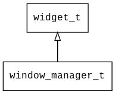

## window\_manager\_t
### 概述


 窗口管理器。

----------------------------------
### 函数
<p id="window_manager_t_methods">

| 函数名称 | 说明 | 
| -------- | ------------ | 
| <a href="#window_manager_t_window_manager">window\_manager</a> | 获取全局window_manager对象 |
| <a href="#window_manager_t_window_manager_back">window\_manager\_back</a> | 请求关闭顶层窗口。 |
| <a href="#window_manager_t_window_manager_back_to_home">window\_manager\_back\_to\_home</a> | 回到主窗口，关闭之上的全部窗口。 |
| <a href="#window_manager_t_window_manager_cast">window\_manager\_cast</a> | 转换为window_manager对象(供脚本语言使用)。 |
| <a href="#window_manager_t_window_manager_dispatch_native_window_event">window\_manager\_dispatch\_native\_window\_event</a> | 处理native window事件。 |
| <a href="#window_manager_t_window_manager_get_pointer_pressed">window\_manager\_get\_pointer\_pressed</a> | 获取指针当前是否按下。 |
| <a href="#window_manager_t_window_manager_get_pointer_x">window\_manager\_get\_pointer\_x</a> | 获取指针当前的X坐标。 |
| <a href="#window_manager_t_window_manager_get_pointer_y">window\_manager\_get\_pointer\_y</a> | 获取指针当前的Y坐标。 |
| <a href="#window_manager_t_window_manager_get_prev_window">window\_manager\_get\_prev\_window</a> | 获取前一个的窗口。 |
| <a href="#window_manager_t_window_manager_get_top_main_window">window\_manager\_get\_top\_main\_window</a> | 获取最上面的主窗口。 |
| <a href="#window_manager_t_window_manager_get_top_window">window\_manager\_get\_top\_window</a> | 获取最上面的窗口。 |
| <a href="#window_manager_t_window_manager_set">window\_manager\_set</a> | 设置缺省的窗口管理器。 |
| <a href="#window_manager_t_window_manager_set_cursor">window\_manager\_set\_cursor</a> | 设置鼠标指针。 |
| <a href="#window_manager_t_window_manager_set_screen_saver_time">window\_manager\_set\_screen\_saver\_time</a> | 设置屏保时间。 |
| <a href="#window_manager_t_window_manager_set_show_fps">window\_manager\_set\_show\_fps</a> | 设置是否显示FPS。 |
#### window\_manager 函数
-----------------------

* 函数功能：

> <p id="window_manager_t_window_manager"> 获取全局window_manager对象


* 函数原型：

```
widget_t* window_manager ();
```

* 参数说明：

| 参数 | 类型 | 说明 |
| -------- | ----- | --------- |
| 返回值 | widget\_t* | 对象。 |
#### window\_manager\_back 函数
-----------------------

* 函数功能：

> <p id="window_manager_t_window_manager_back"> 请求关闭顶层窗口。


* 函数原型：

```
ret_t window_manager_back (widget_t* widget);
```

* 参数说明：

| 参数 | 类型 | 说明 |
| -------- | ----- | --------- |
| 返回值 | ret\_t | 返回RET\_OK表示成功，否则表示失败。 |
| widget | widget\_t* | 窗口管理器对象。 |
#### window\_manager\_back\_to\_home 函数
-----------------------

* 函数功能：

> <p id="window_manager_t_window_manager_back_to_home"> 回到主窗口，关闭之上的全部窗口。

> 由于dialog通常需要用户确认，顶层窗口为dialog时调用会失败。


* 函数原型：

```
ret_t window_manager_back_to_home (widget_t* widget);
```

* 参数说明：

| 参数 | 类型 | 说明 |
| -------- | ----- | --------- |
| 返回值 | ret\_t | 返回RET\_OK表示成功，否则表示失败。 |
| widget | widget\_t* | 窗口管理器对象。 |
#### window\_manager\_cast 函数
-----------------------

* 函数功能：

> <p id="window_manager_t_window_manager_cast"> 转换为window_manager对象(供脚本语言使用)。


* 函数原型：

```
widget_t* window_manager_cast (widget_t* widget);
```

* 参数说明：

| 参数 | 类型 | 说明 |
| -------- | ----- | --------- |
| 返回值 | widget\_t* | window\_manager对象。 |
| widget | widget\_t* | window\_manager对象。 |
#### window\_manager\_dispatch\_native\_window\_event 函数
-----------------------

* 函数功能：

> <p id="window_manager_t_window_manager_dispatch_native_window_event"> 处理native window事件。


* 函数原型：

```
ret_t window_manager_dispatch_native_window_event (widget_t* widget, event_t* e, void* handle);
```

* 参数说明：

| 参数 | 类型 | 说明 |
| -------- | ----- | --------- |
| 返回值 | ret\_t | 返回RET\_OK表示成功，否则表示失败。 |
| widget | widget\_t* | 窗口管理器对象。 |
| e | event\_t* | 事件。 |
| handle | void* | native window句柄。 |
#### window\_manager\_get\_pointer\_pressed 函数
-----------------------

* 函数功能：

> <p id="window_manager_t_window_manager_get_pointer_pressed"> 获取指针当前是否按下。


* 函数原型：

```
bool_t window_manager_get_pointer_pressed (widget_t* widget);
```

* 参数说明：

| 参数 | 类型 | 说明 |
| -------- | ----- | --------- |
| 返回值 | bool\_t | 返回指针当前是否按下。 |
| widget | widget\_t* | 窗口管理器对象。 |
#### window\_manager\_get\_pointer\_x 函数
-----------------------

* 函数功能：

> <p id="window_manager_t_window_manager_get_pointer_x"> 获取指针当前的X坐标。


* 函数原型：

```
xy_t window_manager_get_pointer_x (widget_t* widget);
```

* 参数说明：

| 参数 | 类型 | 说明 |
| -------- | ----- | --------- |
| 返回值 | xy\_t | 返回指针当前的X坐标。 |
| widget | widget\_t* | 窗口管理器对象。 |
#### window\_manager\_get\_pointer\_y 函数
-----------------------

* 函数功能：

> <p id="window_manager_t_window_manager_get_pointer_y"> 获取指针当前的Y坐标。


* 函数原型：

```
xy_t window_manager_get_pointer_y (widget_t* widget);
```

* 参数说明：

| 参数 | 类型 | 说明 |
| -------- | ----- | --------- |
| 返回值 | xy\_t | 返回指针当前的X坐标。 |
| widget | widget\_t* | 窗口管理器对象。 |
#### window\_manager\_get\_prev\_window 函数
-----------------------

* 函数功能：

> <p id="window_manager_t_window_manager_get_prev_window"> 获取前一个的窗口。


* 函数原型：

```
widget_t* window_manager_get_prev_window (widget_t* widget);
```

* 参数说明：

| 参数 | 类型 | 说明 |
| -------- | ----- | --------- |
| 返回值 | widget\_t* | 返回窗口对象。 |
| widget | widget\_t* | 窗口管理器对象。 |
#### window\_manager\_get\_top\_main\_window 函数
-----------------------

* 函数功能：

> <p id="window_manager_t_window_manager_get_top_main_window"> 获取最上面的主窗口。


* 函数原型：

```
widget_t* window_manager_get_top_main_window (widget_t* widget);
```

* 参数说明：

| 参数 | 类型 | 说明 |
| -------- | ----- | --------- |
| 返回值 | widget\_t* | 返回窗口对象。 |
| widget | widget\_t* | 窗口管理器对象。 |
#### window\_manager\_get\_top\_window 函数
-----------------------

* 函数功能：

> <p id="window_manager_t_window_manager_get_top_window"> 获取最上面的窗口。


* 函数原型：

```
widget_t* window_manager_get_top_window (widget_t* widget);
```

* 参数说明：

| 参数 | 类型 | 说明 |
| -------- | ----- | --------- |
| 返回值 | widget\_t* | 返回窗口对象。 |
| widget | widget\_t* | 窗口管理器对象。 |
#### window\_manager\_set 函数
-----------------------

* 函数功能：

> <p id="window_manager_t_window_manager_set"> 设置缺省的窗口管理器。


* 函数原型：

```
ret_t window_manager_set (window_manager_t* widget);
```

* 参数说明：

| 参数 | 类型 | 说明 |
| -------- | ----- | --------- |
| 返回值 | ret\_t | 返回RET\_OK表示成功，否则表示失败。 |
| widget | window\_manager\_t* | 窗口管理器对象。 |
#### window\_manager\_set\_cursor 函数
-----------------------

* 函数功能：

> <p id="window_manager_t_window_manager_set_cursor"> 设置鼠标指针。


* 函数原型：

```
ret_t window_manager_set_cursor (widget_t* widget, const char* cursor);
```

* 参数说明：

| 参数 | 类型 | 说明 |
| -------- | ----- | --------- |
| 返回值 | ret\_t | 返回RET\_OK表示成功，否则表示失败。 |
| widget | widget\_t* | 窗口管理器对象。 |
| cursor | const char* | 图片名称(从图片管理器中加载)。 |
#### window\_manager\_set\_screen\_saver\_time 函数
-----------------------

* 函数功能：

> <p id="window_manager_t_window_manager_set_screen_saver_time"> 设置屏保时间。


* 函数原型：

```
ret_t window_manager_set_screen_saver_time (widget_t* widget, uint32_t screen_saver_time);
```

* 参数说明：

| 参数 | 类型 | 说明 |
| -------- | ----- | --------- |
| 返回值 | ret\_t | 返回RET\_OK表示成功，否则表示失败。 |
| widget | widget\_t* | 窗口管理器对象。 |
| screen\_saver\_time | uint32\_t | 屏保时间(单位毫秒)。 |
#### window\_manager\_set\_show\_fps 函数
-----------------------

* 函数功能：

> <p id="window_manager_t_window_manager_set_show_fps"> 设置是否显示FPS。


* 函数原型：

```
ret_t window_manager_set_show_fps (widget_t* widget, bool_t show_fps);
```

* 参数说明：

| 参数 | 类型 | 说明 |
| -------- | ----- | --------- |
| 返回值 | ret\_t | 返回RET\_OK表示成功，否则表示失败。 |
| widget | widget\_t* | 窗口管理器对象。 |
| show\_fps | bool\_t | 是否显示FPS。 |
